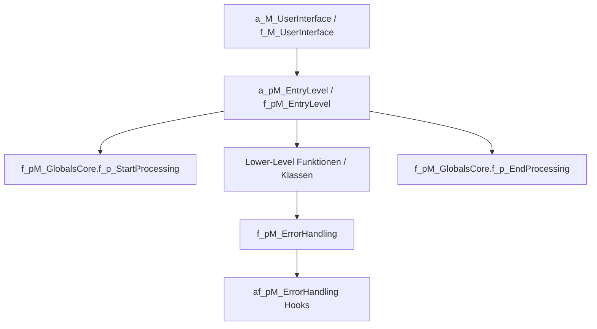
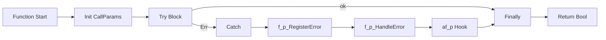
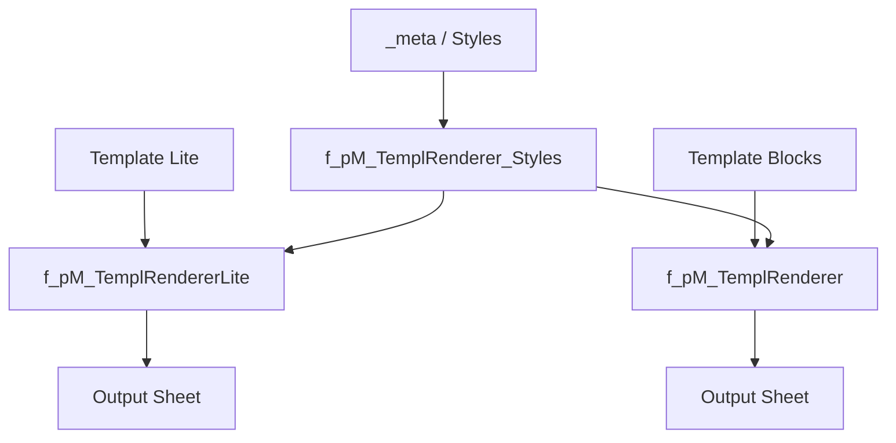
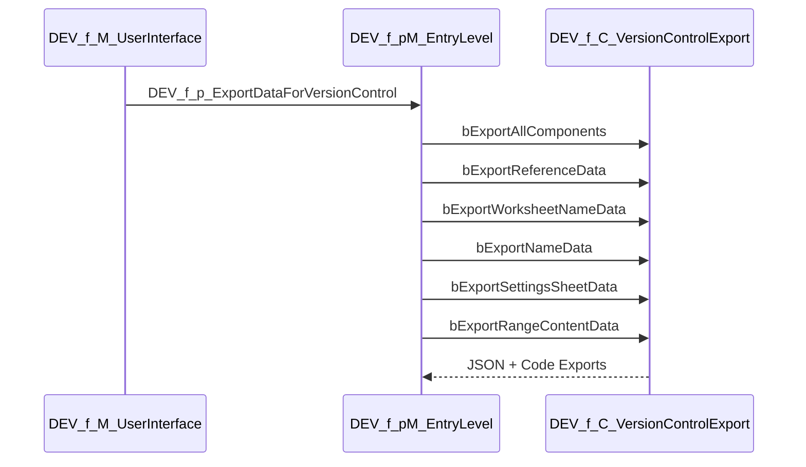

# Flow Framework 2 – Comprehensive Developer Manual (Addendum)

> Hinweis: Die zusammengeführte Fassung mit integrierten Konventionen und Architekturleitlinien ist `developer-manual-unified.md`.

> Diese Datei ist eine **ergänzende** neue Dokumentation zu `developer-manual.md`.
> Sie fasst die aktuelle Repository-Struktur umfassend zusammen, inkl. produktiver Module, DEV-Infrastruktur, Export-/Deployment-Pipeline, Template-Renderer sowie deprecierter Referenzstände.

---

## 1) Zweck und Leitidee des Frameworks

Flow Framework 2 stellt einen stabilen Rahmen für Excel-VBA-Applikationen bereit mit Fokus auf:

- klare Schichten (UI → Entry-Level → Lower-Level → Infrastruktur),
- standardisiertes Error Handling,
- konfigurationsgetriebene Einstellungen über Settings-Sheets,
- DEV/TEST/Version-Control-Export für nachvollziehbare Änderungen,
- strukturierte Deployment-Mechanik (Entfernung von DEV-Komponenten).

Das Repository enthält sowohl den **aktuellen Kern** als auch **historische/deprecierte Teilstände** (`ff2s-little-sis-DEPRECATED`, `independent-features-DEPRECATED`) als Referenz.

---

## 2) Vollständige Strukturübersicht

### 2.1 Aktive Hauptbereiche (Root)

1. **Core/Runtime**
   - globale Initialisierung und Processing Modes (`f_pM_GlobalsCore.bas`),
   - Standard-Entry-Level (`f_pM_EntryLevel.bas`),
   - Error-Registrierung und -Aufbereitung (`f_pM_ErrorHandling.bas`, `f_C_Error.cls`, `f_C_CallParams.cls`).

2. **Application Hooks (`a_` / `af_`)**
   - `a_*`: anwendungsseitige Einstiegspunkte, Worksheet-/Workbook-Events,
   - `af_*`: frameworkgestützte, app-spezifisch zu ergänzende Stellen (z. B. Error-Hooks, Modus-Handling, Settings-Sheet-Liste).

3. **Settings & Konfiguration**
   - `f_C_Settings.cls`: Laufzeitzugriff auf Version/Modi/Flags,
   - `f_C_SettingsSheet.cls` + `f_C_Setting.cls`: Aufbau von Settings-Objekten aus Sheet-Tabellen,
   - mehrere exportierte JSON-Snapshots (`SettingsSheet-*.json`).

4. **Worksheet-/Range-Abstraktionen**
   - `f_C_Wks.cls`: Worksheet-Wrapping, Header-/Datenbereichslogik, Event-Routing,
   - `f_C_DataRecord.cls`, `f_I_DataRecord.cls`: datensatzorientierte Zugriffsmuster,
   - `f_C_RangeArrayProcessor.cls`: teilweise implementiert (Skeleton).

5. **Template Rendering**
   - Lite-Renderer (`f_pM_TemplRendererLite.bas`, `f_M_TemplRendererLite_Types.bas`),
   - erweiterter Renderer (`f_pM_TemplRenderer.bas`, `f_M_TemplRenderer_Types.bas`),
   - Style-Übernahme/Borders (`f_pM_TemplRenderer_Styles.bas`),
   - zusätzliche Legacy-Guidance: `TemplateRendererStyleAndTemplateGuide.md`.

6. **Utilities / Dateisystem / Marker / Deployment**
   - `f_pM_Utilities.bas`, `f_pM_UtilitiesRanges.bas`, `f_pM_UtilitiesFileSystem.bas`,
   - `f_C_DriveMapper.cls` für gemappte Pfade,
   - `f_pM_FloFra2Marker.bas` für Framework-Marker,
   - `f_C_Deploy.cls` für PROD-Kopie + DEV-Strip.

7. **DEV/Test/Export**
   - Teststruktur (`DEV_f_pM_Testing.bas`, `DEV_f_C_UnitTest.cls`, diverse `DEV_f_pM_Test_*`),
   - Exportpipeline (`DEV_f_C_VersionControlExport.cls`, `DEV_f_C_VersionControlRanges.cls`, `DEV_f_C_VersionControlRange.cls`, `DEV_f_pM_EntryLevel.bas`),
   - DEV-UI/Utilities (`DEV_f_M_UserInterface.bas`, `DEV_f_pM_Utilities.bas`, `DEV_f_pM_SandBox.bas`).

8. **Dokumentation & Artefakte**
   - `README.md`, `developer-manual.md`, `AutoManual.md`, `ANALYSE_FRAMEWORK.md`, `version-history.md`,
   - exportierte Metadaten: `Names.json`, `WorksheetNames.json`, `References.json`, `VersionControlledRangeContent.json`.

### 2.2 Deprecated-Bereiche

- **`ff2s-little-sis-DEPRECATED/`**: älterer Framework-Stand inkl. VBA-Exports und Beispieldatei.
- **`independent-features-DEPRECATED/`**: frühere, isolierte Feature-Experimente (z. B. StringFormatter, alte Exportmechanik).

Empfehlung: Diese Bereiche als Referenz behandeln, aber keine neuen Produktiv-Features dort entwickeln.

---

## 3) Laufzeitarchitektur (fachlich)

### 3.1 Prinzipien

- **Entry-Level** orchestriert, validiert und steuert Processing Modes.
- **Lower-Level** liefert fachliche/technische Teilschritte mit booleschem Erfolg.
- **Fehler werden zentral registriert** über `f_C_CallParams` + `f_C_Error`.
- **Hooks** in `af_*` erlauben app-spezifische Reaktionen ohne Eingriff in Core.

---

## 4) Error-Handling-Pattern (zentrales Coding-Muster)

Viele Core-Funktionen nutzen ein einheitliches Template:

1. `f_C_CallParams` initialisieren,
2. `Try: On Error GoTo Catch`,
3. eigentliche Logik,
4. `Finally`-Block,
5. `Catch` mit `f_p_RegisterError` / `f_p_HandleError`,
6. optional Test-/Debug-Verhalten.

### 4.1 Konsequenz für neue Entwicklung

Neue nicht-triviale Prozeduren sollen dieses Muster übernehmen (siehe `f_pM_TemplatesCore*.bas`).

---

## 5) Settings- und Modus-System

### 5.1 Settings-Ladung

- `f_C_Settings` liest zentrale Werte aus benannten Zellen/Names.
- `af_pM_Globals.oCol_af_p_SettingsSheets()` liefert die Liste app-spezifischer Settings-Sheets.
- `f_C_SettingsSheet.bGetSettingsFromSettingsSheet()` baut `f_C_Setting`-Objekte zeilenweise auf.

### 5.2 Modussteuerung

- Framework-Modes (`e_f_p_ProcessingModes`):
  - nur Globals,
  - app-spezifisch,
  - Performance-Mode (ScreenUpdating/Calculation).
- App-Modes (`af_*`, inkl. Passwort-Prüfungen in `af_C_AppModes.cls`) können Maintenance/Development toggeln.

---

## 6) Worksheet-, Daten- und Range-Schicht

### 6.1 `f_C_Wks`

Wesentliche Aufgaben:

- kapselt Worksheet-Zugriff,
- liefert Header-basierte Spaltenzuordnung,
- trennt Datenbereich inkl./exkl. Header,
- unterstützt Event-Routing via Sub-Name (`s_prop_rw_NameOfSubToRunOnWksChange`),
- enthält Sanitizing-Hilfen für UsedRange/Merged Cells.

### 6.2 DataRecord-Abstraktion

- Interface `f_I_DataRecord` + Implementierung `f_C_DataRecord`.
- geeignet für semantischen Feldzugriff ohne direkte Zelladressierung in Business-Logik.

### 6.3 `f_C_RangeArrayProcessor` (Status)

- aktuell nur Basiskomponente (`SanitizeLeadingZeroItems`) vollständig.
- weitere Konstruktor-/Dictionary-Funktionalität ist als Skeleton markiert.

---

## 7) Template-Renderer-Stack

- **Lite Renderer**: einfacher, zeilen-/blocknaher Ablauf.
- **Advanced Renderer**: Block-/Lane-Modell (`fix_`, `rep_`, `rel_`) mit dynamischem Layout.
- **Styles**: Token-basierte Übertragung aus Meta-Daten inkl. Border-Regeln.

Hinweis: `TemplateRendererStyleAndTemplateGuide.md` ist als Legacy-Hinweis gekennzeichnet und nicht überall 1:1 aktuell.

---

## 8) DEV-, Test- und Version-Control-Export

### 8.1 Export-Pipeline

Ergebnis sind aktualisierte Exportdateien (Names, WorksheetNames, References, SettingsSheet-Snapshots, Range-Content).

### 8.2 Unit-Test-Status

- Infrastruktur für Registrierung vorhanden (`DEV_f_C_UnitTest`, `DEV_f_pM_Testing`).
- echter Runner ist aktuell noch als TODO/Skeleton markiert.

---

## 9) Deployment-Mechanik

- `f_C_Deploy.bSaveAsProdAndRemoveDEVModules()` erzeugt eine Produktivkopie (`PROD-*`) und bereinigt DEV-Komponenten.
- Ziel: Entwicklung sicher im selben Projekt halten, aber Release-Artefakt ohne DEV-Last erzeugen.

Empfehlung: Deployment immer auf Version-Control-exportiertem, konsistentem Stand ausführen.

---

## 10) Architektur-Style-Guide (für Erweiterungen)

### 10.1 Schichtenregel

1. UI-Module (`*_UserInterface`) nur für Trigger/Interaktion.
2. Entry-Level (`*_pM_EntryLevel`) für Orchestrierung + Prozessrahmen.
3. Lower-Level für fachliche/technische Einzelschritte.
4. Utilities/Klassen für Wiederverwendung statt Copy/Paste.

### 10.2 Änderungsgrenzen

- `f_*` möglichst nicht fachlich verbiegen (Framework-Core).
- app-spezifische Ergänzungen primär in `a_*` und freigegebenen `af_*`-Abschnitten.
- `DEV_*` nur für Entwicklungsunterstützung, nicht als Produktivabhängigkeit.

### 10.3 Fehlerbehandlung

- keine ad-hoc `MsgBox` in Lower-Level-Prozeduren,
- Fehler über Standardpipeline registrieren,
- User-Kommunikation bevorzugt am Entry-Level.

---

## 11) Coding-Style-Guide (VBA-spezifisch)

### 11.1 Namenskonventionen

- Hungarian-orientierte Typpräfixe (`s`, `l`, `b`, `oC`, `oWks`, …),
- Membership-Präfixe (`a`, `f`, `af`, zusätzlich `DEV_`),
- Properties mit Zugriffssignal (`*_prop_r_*`, `*_prop_rw_*`).

### 11.2 Prozedurdesign

- nicht-triviale Funktion: Bool-Rückgabe + `ByRef`-Ergebnisobjekte,
- Konstante `s_m_COMPONENT_NAME` je Modul/Klasse,
- saubere Trennung von „Fixed, don’t change“-Template-Bereichen und Custom-Code.

### 11.3 Defensive VBA-Praxis

- `Option Explicit` überall,
- Objektzuweisungen immer mit `Set`,
- bei Workbook/Worksheet-Referenzen explizit arbeiten,
- Names/Range-Zugriffe kapseln (`f_pM_Utilities*`) statt verstreutem Direktzugriff.

### 11.4 Events & Seiteneffekte

- Event-Handler kurz halten und delegieren,
- ScreenUpdating/Calculation nur kontrolliert im Processing-Mode verändern,
- OnChange-Routings zentral über vorgesehene Module steuern.

---

## 12) Skeletons, TODO-Zonen und Priorisierung

Im aktuellen Stand sind folgende Bereiche bewusst unvollständig bzw. als Erweiterungspunkte markiert:

1. Template-Prozeduren in `f_pM_TemplatesCore.bas` und `f_pM_TemplatesCoreCompact.bas`.
2. Unit-Test-Ausführungslogik in `DEV_f_pM_Testing.bas`.
3. Teile des Range-/Renderer-Stacks (`f_C_RangeArrayProcessor`, mehrere TODO-Marker in Renderer-Modulen).
4. App-Hooks mit Platzhaltern in `af_pM_ErrorHandling.bas` und `af_pM_Globals.bas`.
5. Version-Control-Ranges-Ausbauhinweise in `DEV_f_C_VersionControlRanges.cls`.

Empfohlene Reihenfolge:

1. Test-Runner vervollständigen,
2. Error-Hooks app-spezifisch schärfen,
3. RangeArrayProcessor vervollständigen,
4. Renderer-TODOs konsolidieren,
5. danach zusätzliche Features.

---

## 13) Praktischer Onboarding-Workflow für neue Entwickler

1. **Lesen**: `README.md`, `developer-manual.md`, diese Addendum-Datei.
2. **Nachvollziehen**: `f_pM_EntryLevel` + `f_pM_GlobalsCore` + `f_pM_ErrorHandling`.
3. **Settings verstehen**: `f_C_Settings`, `f_C_SettingsSheet`, Settings-JSONs.
4. **Events prüfen**: `a_wkb_Main`, `a_wks_*`, `a_pM_OnChangeSubsFor_f_C_Wks`.
5. **DEV-Exports laufen lassen** und JSON-Artefakte vergleichen.
6. **Erst dann** neue Entry-/Lower-Level-Prozeduren nach Template-Muster ergänzen.

---

## 14) Konkrete Erweiterungs-Checkliste (DoD)

Eine neue Funktion gilt als „framework-konform integriert“, wenn:

- [ ] UI-, Entry- und Lower-Level-Verantwortung sauber getrennt sind.
- [ ] Error-Handling-Template vollständig integriert ist.
- [ ] nötige Settings über Settings-Sheet/Names modelliert sind.
- [ ] DEV-Test/Export-Pfade nicht gebrochen sind.
- [ ] Naming-Konventionen (`a/f/af/DEV`, Typpräfixe, Property-Namen) eingehalten sind.
- [ ] Änderung in Produktivpfad und (falls relevant) in DEV- oder Doku-Artefakten nachvollziehbar ist.

---

## 15) Hinweise zu historischen Ständen

Die beiden DEPRECATED-Verzeichnisse dokumentieren Evolution und frühere Lösungsmuster. Sie sind nützlich für:

- Vergleich von API-/Namensentwicklung,
- Wiederverwendung einzelner Ideen,
- Verständnis historischer Architekturentscheidungen.

Für Neuentwicklung gilt dennoch: **am aktiven Root-Framework orientieren**.

---

## 16) Schlussbemerkung

Dieses Addendum ergänzt die bestehende Entwicklerdokumentation um eine vollständige Repository-Perspektive, inklusive Architektur-, Coding- und Workflow-Leitlinien. Es eignet sich als Referenz für Teameinführung, Code-Reviews und die strukturierte Weiterentwicklung von Flow Framework 2.
