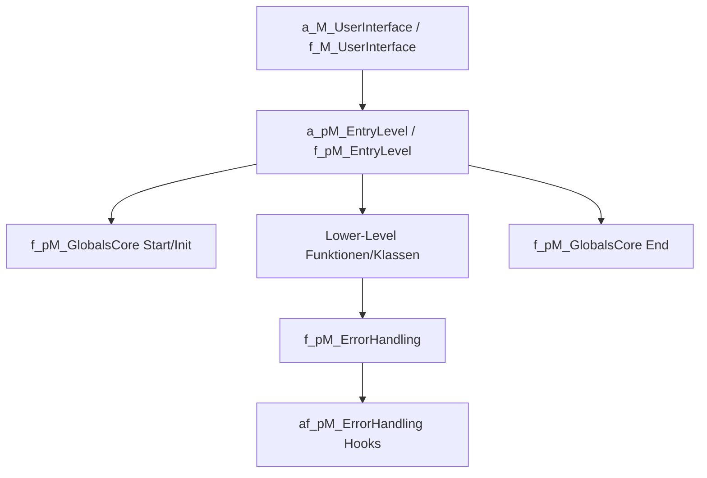
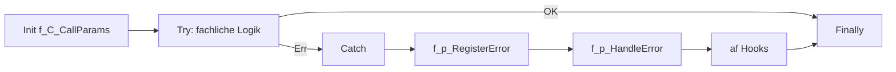
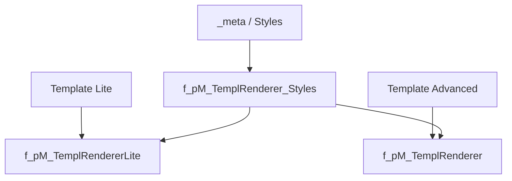
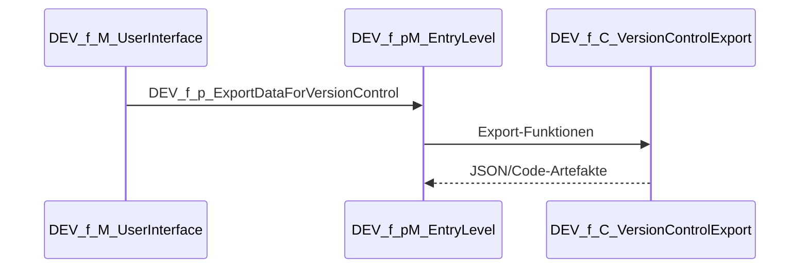

# Flow Framework 2 – Unified Developer Manual

> Diese Datei ist die **zusammengeführte Gesamtdokumentation** aus `developer-manual.md` (konventionelle Regeln, Naming) und `developer-manual-comprehensive.md` (Architektur-, Workflow- und Repository-Gesamtbild).
>
> Ziel: Ein einziges Nachschlagewerk für tägliche Entwicklung, Onboarding und Review.

---

## 1) Scope, Rolle der drei Manual-Dateien

- `developer-manual.md`: ursprüngliche, detaillierte Regelbasis (v. a. Naming-Konventionen).
- `developer-manual-comprehensive.md`: additive Gesamtanalyse (Architektur, Prozesse, TODO-Übersicht).
- `developer-manual-unified.md` (**diese Datei**): konsolidierter Standard für die praktische Nutzung.

---

## 2) Framework-Zielbild

Flow Framework 2 ist ein strukturierter Baukasten für Excel-VBA-Applikationen mit Fokus auf:

- sauberer Schichtung (UI → Entry-Level → Lower-Level → Infrastruktur),
- zentralem Error-Handling,
- settingsgetriebener Konfiguration,
- DEV/Test/Export-Mechanik für Versionierung,
- kontrolliertem Deployment (DEV-freies Produktionsartefakt).

---

## 3) Repository-Navigation (was ist wo?)

### 3.1 Aktive Bereiche
- **Core Runtime**: `f_pM_GlobalsCore.bas`, `f_pM_EntryLevel.bas`, `f_pM_ErrorHandling.bas`.
- **App Hooks**: `a_*` (App), `af_*` (Framework+App-Extension).
- **Settings**: `f_C_Settings.cls`, `f_C_SettingsSheet.cls`, `f_C_Setting.cls` + `SettingsSheet-*.json`.
- **Worksheet/Range-Abstraktion**: `f_C_Wks.cls`, `f_C_DataRecord.cls`, `f_C_RangeArrayProcessor.cls`.
- **Template Renderer**: `f_pM_TemplRenderer*.bas`, `f_M_TemplRenderer*_Types.bas`, Styles in `f_pM_TemplRenderer_Styles.bas`.
- **Utilities/Deploy**: `f_pM_Utilities*.bas`, `f_C_DriveMapper.cls`, `f_C_Deploy.cls`, `f_pM_FloFra2Marker.bas`.
- **DEV/Test/Export**: `DEV_*` Module inkl. `DEV_f_C_VersionControlExport.cls`.

### 3.2 Historische Referenz
- `ff2s-little-sis-DEPRECATED/`
- `independent-features-DEPRECATED/`

Diese Verzeichnisse dienen der Historie und nicht als primärer Zielpfad für neue Features.

---

## 4) Verbindliche Naming- und Strukturkonventionen

## 4.1 Allgemeine Syntax
- Typpräfixe (Hungarian-ähnlich): z. B. `s` (String), `l` (Long), `b` (Boolean), `oC` (Class Object).
- Variablen in CamelCase (`sMyName`), Konstanten in `UPPER_CASE` mit Typpräfix (`sMY_CONST`).
- CodeNames und zentrale Identifikatoren mit Membership-Präfix und `_` zur schnellen Erkennbarkeit.
- DEV-only Komponenten/Prozeduren beginnen mit `DEV_`.

### 4.2 Membership-Präfixe
- `a`: reine Applikation.
- `f`: Framework-Kern (nicht app-spezifisch verändern).
- `af`: Framework mit bewusst vorgesehenen app-spezifischen Ergänzungspunkten.

### 4.3 Excel Defined Names
- Start mit `a`, `f` oder `af`.
- Art-Indikator: `named_cell`, `named_rng`, `named_lo`, `named_fx`.
- Scope-Indikator: `g` (Workbook/global), `m` (Worksheet/private).
- Beispiel: `f_named_cell_s_m_VERSION_NUMBER`.

### 4.4 Property-Benennung
- `*_prop_r_*`: read only,
- `*_prop_w_*`: write only,
- `*_prop_rw_*`: read/write,
- optional `m` als zusätzlicher Indikator für private members (nach Konvention der Basisdatei).

---

## 5) Architektur-Style-Guide

### 5.1 Layering-Regeln
1. UI-Module triggern und delegieren nur.
2. Entry-Level-Prozeduren orchestrieren und setzen Processing-Modes.
3. Lower-Level-Prozeduren kapseln fachliche oder technische Einzelschritte.
4. Gemeinsame Logik in Utilities/Klassen – kein Copy/Paste zwischen Entry-Levels.

### 5.2 Änderungsgrenzen
- Änderungen an `f_*` nur, wenn frameworkweit notwendig.
- Applogik in `a_*` bzw. markierten Bereichen in `af_*`.
- DEV-spezifische Komponenten dürfen im Produktionspfad nicht vorausgesetzt werden.

### 5.3 Error-Handling ist zentralisiert
- Keine ad-hoc Fehlerbehandlung je Modulstil.
- Standard-Template verwenden (`Try/Catch/Finally`-Struktur mit `f_C_CallParams`).
- UI-Meldungen bevorzugt am Entry-Level, Lower-Level i. d. R. silent + logging.

---

## 6) Coding-Style-Guide (VBA)

- `Option Explicit` verpflichtend.
- Objektzuweisung immer mit `Set`.
- Nicht-triviale Lower-Level-Funktionen mit booleschem Return und sauberen `ByRef`-Outputs.
- `s_m_COMPONENT_NAME` je Modul/Klasse konsequent führen.
- In Template-Modulen: „Fixed, don’t change“-Blöcke respektieren.
- Events schlank halten, Logik delegieren.

---

## 7) Settings- und Modusmodell

- Zentrale Runtime-Flags kommen aus `f_C_Settings` (z. B. Debug/Development/Maintenance/TestRun).
- App-spezifische Settings-Sheets werden über `af_pM_Globals.oCol_af_p_SettingsSheets()` angebunden.
- `f_C_SettingsSheet` transformiert tabellarische Sheet-Einträge in `f_C_Setting`-Instanzen.

---

## 8) Template-Rendering (Lite + Advanced)

- Lite: kompakter, schneller Einstieg.
- Advanced: Block/Lane-Konzept (`fix_`, `rep_`, `rel_`) für dynamische Layouts.
- Styles tokenbasiert aus Meta-Daten; Border-Verhalten zentral gesteuert.

---

## 9) DEV, Versionierung und Deployment

### 9.1 DEV-Export

Exportiert u. a.:
- `Names.json`
- `WorksheetNames.json`
- `References.json`
- `SettingsSheet-*.json`
- `VersionControlledRangeContent.json`

### 9.2 Deployment
- `f_C_Deploy.bSaveAsProdAndRemoveDEVModules()` erstellt eine PROD-Datei und entfernt DEV-Komponenten.

---

## 10) Bekannte Skeleton-/TODO-Bereiche

- `f_pM_TemplatesCore*.bas` (Templatebeispiele/Platzhalter),
- `DEV_f_pM_Testing.bas` (Runner-Logik),
- `f_C_RangeArrayProcessor.cls` (nur Teilimplementierung),
- `af_pM_ErrorHandling.bas` / `af_pM_Globals.bas` (app-spezifische Hooks),
- Teile der Renderer und DEV-Export-Range-Verarbeitung.

Empfohlene Reihenfolge:
1. Test-Runner vervollständigen,
2. Error-Hooks konkretisieren,
3. RangeArrayProcessor ausbauen,
4. Renderer-TODOs konsolidieren.

---

## 11) Onboarding und DoD

### 11.1 Onboarding in 6 Schritten
1. `README.md` + diese Datei lesen.
2. `f_pM_GlobalsCore` / `f_pM_EntryLevel` / `f_pM_ErrorHandling` nachvollziehen.
3. Settingsfluss (`f_C_Settings*`) prüfen.
4. Events (`a_wkb_Main`, `a_wks_*`) verstehen.
5. DEV-Export ausführen und JSON-Artefakte vergleichen.
6. Erst danach neue Entry-/Lower-Level-Funktion integrieren.

### 11.2 Definition of Done
- [ ] Schichten sauber getrennt.
- [ ] Standard-Error-Handling integriert.
- [ ] Naming-Konventionen eingehalten.
- [ ] Settings sauber modelliert.
- [ ] DEV-/Export-Pfad nicht gebrochen.
- [ ] Dokumentation aktualisiert (mind. diese Datei oder betroffene Spezialdoku).

---

## 12) Entscheidungshilfe: Welche Manual-Datei nutze ich wann?

- **Schneller Gesamtüberblick + konkrete Leitlinien** → `developer-manual-unified.md`.
- **Originalregeln in historischer Form/Namingschärfe** → `developer-manual.md`.
- **Additive Tiefenanalyse/ergänzende Perspektive** → `developer-manual-comprehensive.md`.

